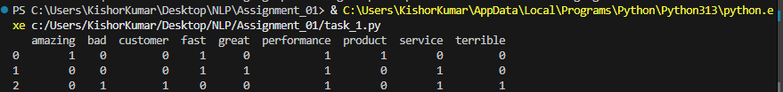
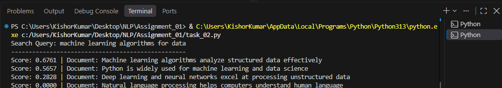

# LAB EXERCISE 04: Vector Space Modeling Bag of Words (BoW) & Cosine Similarity

**Course:** Natural Language Processing (CS-602/DS-604)
**Student Name:** Kishor Kumar
**Roll No:** 2K24/AI/41
**Program:** BS Artificial Intelligence
**University:** University of Sindh, Jamshoro

## Objective
Implementation of Bag of Words (BoW) and Cosine Similarity to represent textual data as numerical vectors and compute pairwise document similarity using Python's `scikit-learn` library.

---

## Task 1: Bag of Words Matrix Construction
*Constructing a vocabulary and generating a term-frequency matrix using `CountVectorizer` with English stop words removed.*

**Output Screenshot:**
<!-- Replace the link below with the actual path to your screenshot -->

---

## Task 2: Document Search Engine & Relevance Ranking
*A mini search engine that accepts a search query and ranks documents based on cosine similarity scores.*

**Output Screenshot:**
<!-- Replace the link below with the actual path to your screenshot -->

---

## Section 5: Lab Viva & Reflection Answers

**1. Word Order Invariance:** 
The Bag of Words (BoW) model strictly counts word occurrences and completely ignores grammar, semantics, and word order. As a result, "Dog bites man" and "Man bites dog" yield the exact same numerical vector. In sentiment analysis, this is problematic because it fails to capture context or negations (e.g., missing the distinction between "good" and "not good"), potentially leading to inaccurate sentiment classification.

**2. Sparsity Issue:** 
When a corpus extracts a vocabulary of 100,000 unique words, every single document is represented by a 100,000-dimensional vector. Because a single document typically contains only a tiny fraction of the total vocabulary, the resulting BoW matrix will be highly sparse (densely packed with zeros). This drastically increases memory consumption and computational overhead.

**3. Zero Similarity:** 
Cosine similarity measures the geometric angle between vectors based on overlapping terms. Document 3 ("Natural language processing helps computers understand human language") contains absolutely zero vocabulary words in common with the query ("machine learning algorithms for data"). Because there are no shared terms, the dot product is zero, resulting in a Cosine Similarity score of 0.0000 (completely orthogonal).
